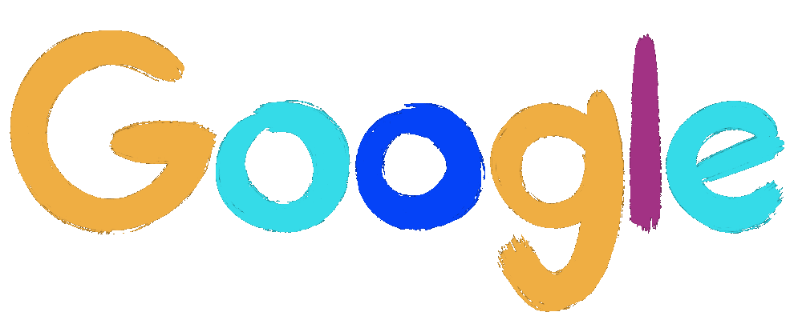
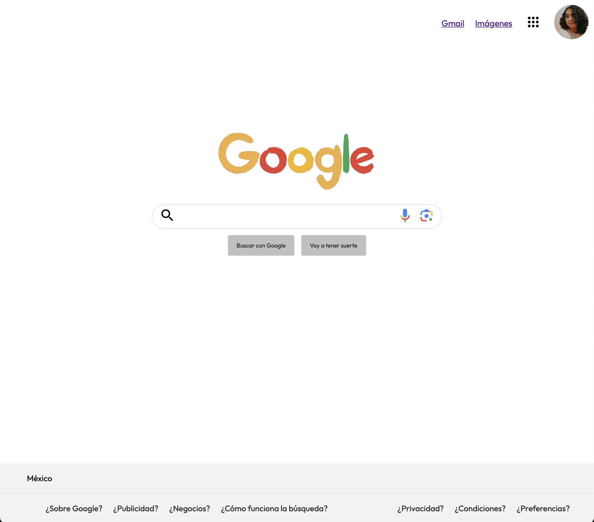

# Clon de Google 🤓  

## Objetivo 🚀  
El objetivo de este proyecto fue practicar y desarrollar nuestras habilidades en el lenguaje de programación, abarcando HTMLy CSS. Además, en este proyecto decidí utilizar mis conocimientos de animación y teoría del color para diseñar un doodle de Google: consideré los colores complementarios de cada uno de los colores institucionales de la marca y los sustituí en el logo generando una animación.  

## Descripción 📚  
Realicé este proyecto a lo largo del mes de junio del año 2024, en el marco del curso intensivo TECNOLOchicas PRO Bootcamp. Durante este período, me dediqué a aplicar y expandir mis conocimientos en diversas áreas de la tecnología y la programación. El curso, diseñado específicamente para impulsar la participación de mujeres en el campo de la tecnología, me brindó una excelente oportunidad para aprender y practicar nuevas habilidades, culminando en la realización de este proyecto como una demostración de todo lo aprendido.  

[Visítalo](https://gooogle-com.netlify.app)  

## Herramientas 🛠️
- HTML  
- CSS
